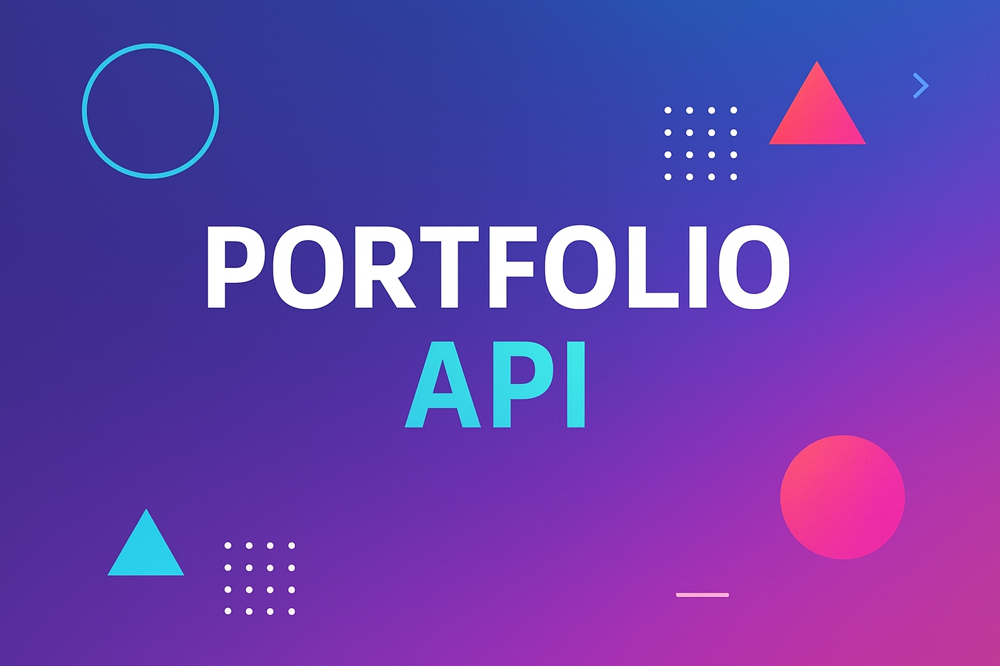

<h1 align="center">API Testing Automation Portfolio</h1>

  

  A complete portfolio of API testing automation projects built with <strong>Postman</strong>, <strong>Newman</strong>, and <strong>JavaScript</strong>.  
  Each collection represents a different level of professional QA practice — from RESTful CRUD validation to GraphQL and contract testing.

  🔗 <strong>Explore the live collection on Postman:</strong> 
  <a href="https://www.postman.com/personal-qa-workspace/qa-portfolio" target="_blank">
    🌐 View Postman Workspace – QA Automation Portfolio
  </a>

<h2>Table of Contents</h2>
<ul>
  <li><a href="#overview">Overview</a></li>
  <li><a href="#collections">Collections</a></li>
  <li><a href="#technologies">Technologies Used</a></li>
  <li><a href="#how-to-run">How to Run</a></li>
  <li><a href="#coverage">Test Coverage & Metrics</a></li>
  <li><a href="#standards">Quality & Standards</a></li>
  <li><a href="#author">Author</a></li>
</ul>

<h2 id="overview">Overview</h2>

This portfolio showcases <strong>advanced API testing automation</strong> built using <strong>Postman</strong> and <strong>Newman CLI</strong>, following <strong>ISTQB-aligned methodologies</strong>.
Each collection focuses on a specific testing area:

<ul>
  <li><strong>RESTful CRUD Testing:</strong> Validates complete API lifecycle (create, read, update, delete)</li>
  <li><strong>E-commerce Workflow Automation:</strong> Simulates authentication, cart, and purchase flows</li>
  <li><strong>Contract Testing:</strong> Ensures JSON Schema compliance and backward compatibility</li>
  <li><strong>GraphQL Testing:</strong> Validates queries, mutations, variables, and fragments</li>
</ul>

All projects include <strong>reusable scripts, assertions, dynamic variables,</strong> and are ready for CI/CD execution.

<h2 id="collections">Collections</h2>

<h3>ReqRes API – Complete Testing Suite</h3>

Comprehensive RESTful testing collection demonstrating CRUD validation, dynamic chaining, and performance benchmarking.  
Applies ISTQB techniques such as Equivalence Partitioning, Boundary Value Analysis, and Error Guessing.

<ul>
  <li><strong>Requests:</strong> 23</li>
  <li><strong>Tests:</strong> 121+</li>
  <li><strong>Assertions:</strong> 187+</li>
  <li><strong>Coverage:</strong> Full CRUD + Workflow testing</li>
</ul>

---

<h3>DummyJSON E-commerce API – End-to-End Testing</h3>

Advanced e-commerce testing suite validating authentication, catalog operations, cart management, and purchase flows.  
Includes JWT token validation, request chaining, and business rule assertions.

<ul>
  <li><strong>Requests:</strong> 26</li>
  <li><strong>Tests:</strong> 186+</li>
  <li><strong>Modules:</strong> Auth, Users, Products, Cart, Workflows</li>
</ul>

---

<h3>Contract Testing & JSON Schema Validation</h3>

Ensures APIs comply with predefined contracts using <strong>Ajv</strong> and <strong>JSON Schema v7</strong>.  
Detects breaking changes, missing fields, and data type mismatches.

<ul>
  <li><strong>Requests:</strong> 3 (Users, Products, Carts)</li>
  <li><strong>Tests:</strong> 70+</li>
  <li><strong>Validations:</strong> Required fields, Enums, Ranges, Formats</li>
</ul>

---

<h3>GraphQL API Testing (New Collection)</h3>

Modern API testing approach using <strong>GraphQL</strong> queries, mutations, variables, and fragments.  
Demonstrates validation of complex nested data structures, response timing, and schema conformity.

<ul>
  <li><strong>Focus:</strong> Query & Mutation Testing</li>
  <li><strong>Features:</strong> Variables, Fragments, Type Checking, Error Handling</li>
</ul>

---

<h2 id="technologies">Technologies Used</h2>

  <!--Main Tools-->
  
  
  
  
  
  

  <!--Pipeline State-->
  

---

<h2 id="how-to-run">How to Run</h2>

<ol>
  <li>Clone this repository:
    <pre><code>git clone https://github.com/PortillaXpert/API-Testing-Automation-Portfolio.git</code></pre>
  </li>
  <li>Install <strong>Newman</strong>:
    <pre><code>npm install -g newman</code></pre>
  </li>
  <li>Run any collection:
    <pre><code>newman run ./collections/01_-_ReqRes_API_Testing.postman_collection.json -e ./environments/ReqRes_Production.postman_environment.json</code></pre>
  </li>
</ol>

---

<h2 id="coverage">Test Coverage & Metrics</h2>

| Collection | Requests | Tests | Assertions | Coverage |
|-------------|-----------|--------|-------------|-----------|
| ReqRes API | 23 | 121+ | 187+ | 100% CRUD |
| DummyJSON E-commerce | 26 | 186+ | 220+ | End-to-End Workflows |
| Contract Testing | 3 | 70+ | 100+ | Schema Compliance |
| GraphQL Testing | – | – | – | Query & Mutation Validation |

---

<h2 id="standards">Quality & Standards</h2>
<ul>
  <li>ISTQB-aligned design: EP, BVA, State Transition, Decision Table</li>
  <li>RESTful & GraphQL testing best practices</li>
  <li>Reusability through dynamic variables & environment configs</li>
  <li>Schema validation with Ajv (JSON Schema v7)</li>
  <li>CI/CD ready structure for Newman execution</li>
</ul>

---

<h2 id="author">Author</h2>

  Created by <a href="https://github.com/PortillaXpert" target="_blank"><strong>Juan Pablo Portilla</strong></a> 
  <em>QA Automation Engineer</em> 
  <a href="mailto:jrivera082002@gmail.com">jrivera082002@gmail.com</a> · 
  <a href="www.linkedin.com/in/juan-pablo-rivera-a90335374" target="_blank">LinkedIn</a>

  (<a href="#readme-top">Back to top ↑</a>)

